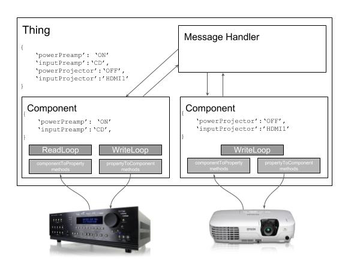

# pyIOT


A python module to simplify writing device drivers for the Amazon AWS IOT service

pyIOT abstracts the AWS IOT-Core service handling all of the communications between it and our device.  To implement a pyIOT application, you only need to specify how to convert from the protocol of your device into the properties that you want to expose to IOT-Core and vice-versa.  This enables IOT-Core applications to be written in a handful of lines of code.

A simple pyIOT application looks as follows...

```python

import serial
import pyIOT

class Relay(Component):
  @Component.componentToProperty('relayState', '^RELAY(ON|OFF)$')
  def toRelayState(self, property, value):
      val = { 'ON': True, 'OFF': False }.get(value)
      if val: return val
      raise ValueError('{0} is not a valid value for property {1}'.format(value, property))

  @Component.propertyToComponent('relayState', 'RELAY{0}')
  def fromRelayState(self, value):
      val = { True: 'ON', False: 'OFF' }.get(value)
      if val: return val
      raise ValueError('{0} is not a valid relayState'.format(value))

  def queryStatus(self):
    return 'RELAY?\n'

try:
  ser = serial.Serial('/dev/ttyUSB0',9600, timeout=0.5)
  relayComponent = Relay(name = 'RelayComponent1', stream = ser, synchronous=True)

  relayThing = Thing(endpoint='<your endpoint>', thingName='relayOne', rootCAPath='root-CA.crt', certificatePath='relayOne.crt',
    privateKeyPath='relayOne.private.key', region='us-east-1', components=relayComponent)
  relayThing.start()
except KeyboardInterrupt:
  relayComponent.exit()
```
