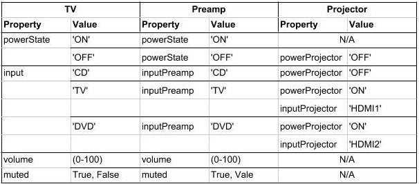

Brief Overview of AWS IOT-Core
==============================

pyIOT relies upon the AWS IOT-Core service.  IOT-Core is a highly scalable system to control potentially large populations of IOT devices.  It provides a stable end-point that a controlling application can call to in order to control an IOT device, referred to within IOT-Core as a Thing.  In IOT-Core, a thing is represented by a set of properties which represent the state of the IOT device.  IOT-Core stores these properties as key-value pairs inside a structure called a device Shadow which is a JSON object containing three key-value pair sets (desired, reported, delta).  When an application wants to cause an IOT device to do something, it changes the desired state within the Shadow to the value that will cause the requested change.  pyIOT listens for these updates and then handles the conversion of the request into the specific message needed by the device to cause the appropriate change to occur.  When the device itself changes, pyIOT also handles converting the data coming from the device into a valid property value and sending that to the IoT-Core Shadow for the IOT device.

More details about AWS IOT-Core can be found at https://aws.amazon.com/iot-core/

Case Study
==========

If you have ever owned a stereo made up of separate components (preamp, amp, CD player, DVD player, etc) you know the difficulty of getting all of the settings correct in order to set it up for a particular task.  Want to play a CD?  The preamp has to be on, the CD player has to be on, the preamp has to be to the CD input, and the volume needs to be set to an appropriate level.  This gets even more complicated when you add a TV or a projector to the mix.

In this example, we are going to show how to turn a combination of a popular hi-fi preamp and a popular projector into a single *Thing* which acts as a TV.  The two devices that will be used are an Anthem AVM20 preamp, and an Epson 1080UB projector.  Both of these represent reasonably common devices that each have their own automation protocol accessible via their serial interfaces.  More recent versions of both are still on the market (as of Aug 2018).

Modeling the TV
---------------

To build our TV, we will need to develop Components for the preamp and the projector.  Somewhat boringly we'll call these PreampComponent and ProjectorComponent.  These will both be encapsulated into a Thing we'll call TVThing.

We also need to determine what properties that we are going to use to control our TV.  The properties that we will use are:

* powerState (str): The power status of the TV.  Valid values are 'ON' if TV is on else 'OFF'
* input (str): The current selected input of the TV. Valid values are 'CD', 'DVD', 'TV'
* volume (integer): The current volume level.  Valid values are (0-100).
* muted (bool): The muted setting.  Valid values are True of the TV is muted or False if it is not muted.

These values were chosen because they are the same names that the Alexa Smart Home Skill would use so if we later decide to interface our IOT with that service, we will not have to translate property names.

There is some ambiguity though with these properties.  Our Thing is composed of two separate components, each of which has its own state.  If our TV's powerState is 'ON', is the preamp on, the projector on, both?  We need to determine how we should treat these individual states in our properties.  Volume and muted are straight forward as they only exist on the preamp.  However, the concepts of input and powerState exist on both devices.  Lets start with powerState.  If we were going to listen to music from our CD player, the preamp would be on, but not TV.  So it is reasonable for the powerState of our TV to be 'ON' when the preamp is on, but not the projector.  However, the opposite is not true.  It would not be normal to have the projector on, without the preamp also being on as this would prevent us from hearing the program that is being displayed.  So we are going to assign powerState to the preamp.  We will still need to separately control the projector power though so we will add an additional property to deal with that.  Input is not as simple.  Both devices have inputs that need to be managed.  Let's assume we have the following sources connected to our TV.

CD Player - Connected to preamp's CD input
Cable box - Connected to preamp's TV input and projector's HDMI1 input
Blueray Player - Connected to preamp's DVD input AND projectors HDMI2 input

As you can see, we will need to be able to separately control both the preamp's and the projector's inputs so we will add properties dedicated to both.  So we need to add the following three additional properties:

* inputPreamp (str): The current selected input for the preamp.  Valid values are 'CD', '2-Channel', '6-Channel', 'Tape', 'Radio', 'DVD', 'TV', 'SAT', 'VCR', 'AUX'
* inputProjector (str): The current selected input for the projector.  Valid values are 'HDMI1', 'HDMI2', 'S-VIDEO', 'Component1', 'Component2'
* powerProjector (str): The power status of the projector.  Valid values are 'ON', 'WARMING', 'COOLING', 'OFF'

The last thing we need to determine is how to map the individual component properties into the TV level properties.  We'll do this using the following state table.

Writing the preamp Component
----------------------------

The Anthem AVM20 preamp used in this example is a very full featured device and allows most of its features to be controlled through its automation protocol.  For our purposes though we will only be using a small fraction of its capabilities.  We need to be able to turn it on and off, select the CD, DVD, and TV inputs, change its volume and select or deselect its muted setting.

Anthem AVM 20 automation protocol
~~~~~~~~~~~~~~~~~~~~~~~~~~~~~~~~~

The Anthem AVM20's automation protocol is asynchronous.  When you send a valid command, it replies with a set of messages letting you know all of the changes that have occurred as a result of the command.  In addition, if the preamp's front panel is used to change its settings, the AVM20 will proactively send messages to indicate the changes that have occurred.

The format for a message is <message>\\n.

We will use the following subset of the AVM20s automation protocol

+--------+-----------+--------------------------------------------------------------------+--------------------------------------------+
| Action | Command   | Variables                                                          | Returns                                    |
+========+===========+====================================================================+============================================+
| power  | P1Px      | x = 0,1 for OFF, ON                                                | P1Px                                       |
+--------+-----------+--------------------------------------------------------------------+--------------------------------------------+
| power  | P1P?      |                                                                    | P1Px where                                 |
| query  |           |                                                                    | x = 0,1 for OFF, ON                        |
+--------+-----------+--------------------------------------------------------------------+--------------------------------------------+
| input  | P1Sa      | a = 0-9 for CD, 2-Ch, 6-Ch, Tape, Radio, DVD, TV, SAT, VCR, AUX    | P1Sa                                       |
+--------+-----------+--------------------------------------------------------------------+--------------------------------------------+
| volume | P1VMsbb.b | s = +, - for above, below reference volume bb.b for amount in db   | P1VMsbb.b                                  |
+--------+-----------+--------------------------------------------------------------------+--------------------------------------------+
| muted  | P1Mx      | x = 0, 1 for not muted, muted                                      | P1Mx                                       |
+--------+-----------+--------------------------------------------------------------------+--------------------------------------------+
| query  | P1?       | Query the status of the device (for the main zone).  Note: the     | P1SaVsbb.bMcDdEe                           |
|        |           | Anthem AVM20 supports three separate zones of audio playback.      | a for input, sbb.b for volume, c for muted |
|        |           |                                                                    | d for decoder status (not used), and       |
|        |           |                                                                    | e for stereo effect (not used)             |
+--------+-----------+--------------------------------------------------------------------+--------------------------------------------+

\* Reference volume is set during installation and is represented as volume 0.0.  Typically a system is calibrated so that the reference volume produces 85db of sound when fed a signal that is -20db.  You may find http://www.acousticfrontiers.com/2013314thx-reference-level/ a useful description of this concept.

preampComponent source code
~~~~~~~~~~~~~~~~~~~~~~~~~~~

A quick reminder of the required activities.

* Write a componentToProperty method for every property the component supports

    + Requires a regex that exactly matches the input related to the property
    + Regex must have a group for each property value contained within a supported message

* Write a propertyToComponent method for every property the component supports
* Write a queryStatus method if you want to periodically poll your device for its current status

.. code-block:: python

    class preampComponent(Component):

        ''' COMPONENT TO PROPERTY METHODS '''

        # convert anthem power message into powerState property
        @Component.componentToProperty('powerState', '^P1P([0-1])$')
        def avmToPowerState(self, property, value):
            val = { '1': 'ON', '0': 'OFF' }.get(value)
            if val: return val
            raise ValueError('{0} is not a valid value for property {1}'.format(value, property))

        # convert anthem input message into input property
        @Component.componentToProperty('input', '^P1S([0-9])$')
        def avmToInput(self, property, value):
            val = { '0': 'CD', '3': 'TAPE', '5': 'DVD', '6': 'TV', '7': 'SAT', '8': 'VCR', '9': 'AUX' }.get(value)
            if val: return val
            raise ValueError('{0} is not a valid value for property {1}'.format(value, property))

        # convert anthem volume message into volume property
        @Component.componentToProperty('volume', '^P1VM([+-][0-9]{1,2}(?:[\\.][0-9]{1,2})?)$')
        def avmToVolume(self, property, value):
            try:
                rawvol = float(value)
                return self._db(rawvol)
            except:
                raise ValueError('{0} is not a valid value for property {1}'.format(value, property))

        # convert muted message into muted property
        @Component.componentToProperty('muted', '^P1M([0-1])$')
        def avmToMuted(self, property, value):
            val = { '1': True, '0': False }.get(value)
            if val is not None: return val
            raise ValueError('{0} is not a valid value for property {1}'.format(value, property))

        # This is the response to the query command.  It returns information for several properties
        # Note that we are passing it a list of properties and that the regex has multiple match groups
        @Component.componentToProperty(['input', 'volume', 'muted'], '^P1S([0-9])V([+-][0-9]{2}[\\.][0-9])M([0-1])D[0-9]E[0-9]$')
        def avmcombinedResponse(self, property, value):
            return { 'input': self.avmToInput, 'volume': self.avmToVolume, 'muted': self.avmToMuted }.get(property)(property, value)

        ''' PROPERTY TO COMPONENT METHODS '''

        # Command preamp to turn on or off
        @Component.propertyToComponent('powerState', 'P1P{0}')
        def powerStateToAVM(self, value):
            val = { 'ON': '1', 'OFF': '0' }.get(value)
            if val: return val
            raise ValueError('{0} is not a valid powerState'.format(value))

        # Command preamp to change input
        @Component.propertyToComponent('input', 'P1S{0}')
        def inputToAVM(self, value):
            val = { 'CD': '0', 'TAPE': '3', 'DVD': '5', 'TV': '6', 'SAT': '7', 'VCR': '8', 'AUX': '9' }.get(value)
            if val: return val
            raise ValueError('{0} is not a valid input'.format(value))

        # Command preamp to change its volume
        @Component.propertyToComponent('volume', 'P1VM{0}')
        def volumeToAVM(self, value):
            if type(value) is int: return _volume(value)
            raise ValueError('{0} is not a valid volume'.format(value))

        # Command preamp to mute or unmute
        @Component.propertyToComponent('muted', 'P1M{0}')
        def muteToAVM(self, value):
            val = { True: '1', False: '0' }.get(value)
            if val: return val
            raise ValueError('{0} is not a valid muted value'.format(value))

        ''' Ask the preamp what it's current status is '''
        def queryStatus(self):
            ''' The Anthem only allows you to query its status when it is on.  When it is off you can only ask for power state '''
            if self.properties['powerState'] == 'ON':
                return 'P1?\n'
            else:
                return 'P1P?\n'

        ''' The remaining methods are to handle the conversation from volume to db and vice-versa '''
        @staticmethod
        def _volumeToDb(v):
            ''' Convert a volume in the range 0 to 100 into a db value.  This provides an exponential curve from -69db to +10db. '''
            return float( -1*((100-v)**2.25)/400)+10

        ''' compute array of possible volume to db values '''
        _volArray = []
        for v in range (0,101):
          _volArray.append(_volumeToDb(v))
        del v

        @staticmethod
        def _volume(v):
            ''' Get volume from volArray and round to nearest 0.5db '''
            return int(5*round(float(_volArray[v])/5*10))/10

        @staticmethod
        def _db(db):
            ''' Find the closest db value from volArray and return corresponding volume value '''
            ar = self._volArray
            s = 0
            e = len(ar)-1
            cp = int(e/2)
            while True:
                if e == s: return e
                if e-s == 1:
                    if db <= ((ar[e] - ar[s])/2)+ar[s]: return s
                    return e
                if db == ar[cp]: # Exact match.  Got lucky
                    for i in range(cp+1, e+1):
                        if db < ar[i]: return cp
                        cp = i
                    return cp
                if db < ar[cp]: # value is less than the current position
                    if cp == 0: return cp # If we are already at the start of the array then the value is below the lowest value.  Return 0.
                    e = cp
                if db > ar[cp]: # value is greater than current position
                    if cp == len(ar)-1: return cp # If we are at the end of the array, the value is bigger than the highest value.  Return len of array
                    s = cp
                cp = int((e-s)/2)+s

Writing the projector Component
-------------------------------

The Epson 1080UB projector was a popular LCD projector sold in the late 2000s.

Epson ESC/VP21 automation protocol
~~~~~~~~~~~~~~~~~~~~~~~~~~~~~~~~~~

The Epson 1080UB uses Epson's ESC/VP21 automation protocol.  It is a synchronous protocol only responding as a result of a command being sent to it.  This means that you must poll the projector to find out what changes may have occurred to it.

The format for a message is :<command> <parameter>\\r with the projector providing the ':' character and the controlling system providing the command, parameter and the carriage return '\\r'.  So for this projector, end of line is '\\r:' as opposed to the more standard '\\n'.

We will use the following subset of the Epson ESC/VP21 automation protocol

+--------+-----------+--------------------------------------------------------------------+--------------------------------------------------+
| Action | Command   | Variables                                                          | Returns                                          |
+========+===========+====================================================================+==================================================+
| power  | PWR x     | x = ON, OFF                                                        | PWR=x where                                      |
|        |           |                                                                    | x = 00,  01,      02,      03,      04,       05 |
|        |           |                                                                    | for ON, OFF, WARMING, COOLING, STANDBY, ABNORMAL |
+--------+-----------+--------------------------------------------------------------------+--------------------------------------------------+
| power  | PWR?      |                                                                    | PWR=x where                                      |
| query  |           |                                                                    | x = 00,  01,      02,      03,      04,       05 |
|        |           |                                                                    | for ON, OFF, WARMING, COOLING, STANDBY, ABNORMAL |
+--------+-----------+--------------------------------------------------------------------+--------------------------------------------------+
| input  | SOURCE a  | a =    30,    A0,    41,      42                                   | SOURCE=a where                                   |
|        |           | for HDMI1, HDMI2, VIDEO, S-VIDEO                                   | a = 30,       A0,    41,      42                 |
|        |           |                                                                    | for HDMI1, HDMI2, VIDEO, S-VIDEO                 |
+--------+-----------+--------------------------------------------------------------------+--------------------------------------------------+
| input  | SOURCE?   |                                                                    | SOURCE=a where                                   |
| query  |           |                                                                    | a = 30,       A0,    41,      42                 |
|        |           |                                                                    | for HDMI1, HDMI2, VIDEO, S-VIDEO                 |
+--------+-----------+--------------------------------------------------------------------+--------------------------------------------------+

projectorComponent source code
~~~~~~~~~~~~~~~~~~~~~~~~~~~~~~

.. code-block:: python

    class projectorComponent(Component):

        ''' COMPONENT TO PROPERTY METHODS '''

        @Component.componentToProperty('projPowerState', '^PWR=([0-9]{2})$')
        def toProjPowerState(self, property, value):
            val = { '00': 'OFF', '01': 'ON', '02': 'WARMING', '03': 'COOLING', '04': 'STANDBY', '05': 'ABNORMAL' }.get(value)
            if val: return val
            raise ValueError('{0} is not a valid value for property {1}'.format(value, property))

        @Component.componentToProperty('projInput', '^SOURCE=([a-zA-Z0-9]{2})$')
        def toProjInput(self, property, value):
            val = { '30': 'HDMI1', 'A0': 'HDMI2', '41': 'VIDEO', '42': 'S-VIDEO' }.get(value)
            if val: return val
            raise ValueError('{0} is not a valid value for property {1}'.format(value, property))

        ''' PROPERTY TO COMPONENT METHODS '''

        @Component.propertyToComponent('projPowerState', 'PWR {0}\r')
        def projPowerStateToProj(self, value):
            if value in ['ON', 'OFF']: return value
            raise ValueError('{0} is not a valid powerState'.format(value))

        @Component.propertyToComponent('projInput', 'SOURCE {0}\r')
        def projInputToProj(self, value):
            val = { 'HDMI1': '30', 'HDMI2': 'A0', 'VIDEO': '41', 'S-VIDEO': '42' }.get(value)
            if val: return val
            raise ValueError('{0} is not a valid input'.format(value))

        ''' STATUS QUERY METHOD '''

        def queryStatus(self):
            if self.properties['projPowerState'] == 'ON':
                return ['PWR?\r','SOURCE?\r']
            else:
                return 'PWR?\r'

    	''' READY STATE METHOD '''

        def ready(self):
    		''' Projector stops accepting commands while turning on or off (up to 30 seconds) '''
            return True if self.properties['projPowerState'] in ['ON', 'OFF', 'UNKNOWN'] else False

Writing the Thing
-------------------------------

The Thing in a pyIOT project is used to contain all of the components that make up the thing.  It listens to AWS IOT-Core, routing received messages to the appropriate component.  It also passes messages from the components to AWS IOT-Core so that IOT-Core has up-to-date information about the Thing's state.  Finally it is responsible for coordinating state between it's components.  If a component changes state that impacts the state of a different component, the Thing uses its onChange method to determine what additional property value changes should also be commanded.  This last feature is not always needed but is often required with multi-component Things.
