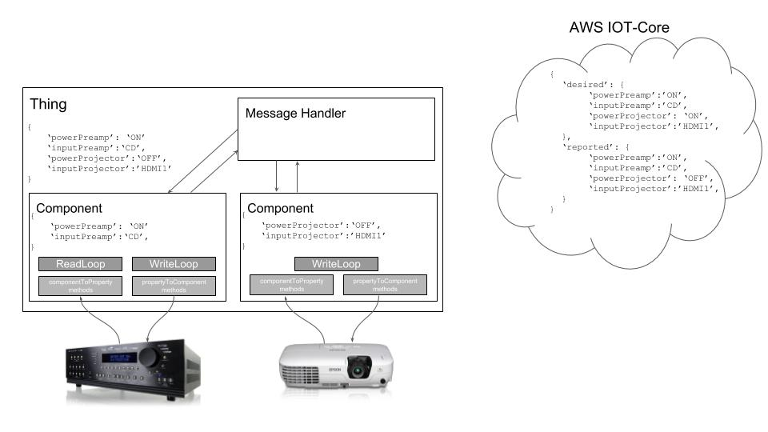

.. pyIOT documentation master file, created by
   sphinx-quickstart on Sun Jul 22 08:53:40 2018.
   You can adapt this file completely to your liking, but it should at least
   contain the root `toctree` directive.

pyIOT
=================================
**Simplifying the creation of a python-based Internet of Things (IOT) device.**

*by dhrone*

.. moduleauthor:: dhrone
.. module:: pyIOT

pyIOT enables rapid integration of a device with the Amazon AWS IOT-Core service.  In IOT-Core, a thing is represented by a set of properties which represent the state of the IOT device.  Within IOT-Core, these properties are stored as key-value pairs inside a structure called a device Shadow which is a JSON object containing three key-value pair sets (desired, reported, delta).  When an application wants to cause an IOT device to do something, it changes the desired state within the Shadow to the value that will cause the requested change.  pyIOT listens for these updates and then handles the conversion of the request into the specific message needed by the device to cause the appropriate change to occur.  When the device itself changes, pyIOT also handles converting the data coming from the device into a valid property value and sending that to the IoT-Core Shadow for the IOT device.

More details about AWS IOT-Core can be found at https://aws.amazon.com/iot-core/.

.. automodule:: pyIOT

User Guide
==========

This is where the user guide stuff will go.

.. toctree::
  :maxdepth: 2

  guide

Example Project
===============

This is where the example project using the Epson and AVM components will go

API Guide
=========

This section contains details on pyIOT's two classes.  The first is Component which handles the interaction between a physical device.  The second is Thing which is the container of all of the components that make up a thing and handles all of the communications with the AWS IOT-Core service.

.. toctree::
  :maxdepth: 2

  class
